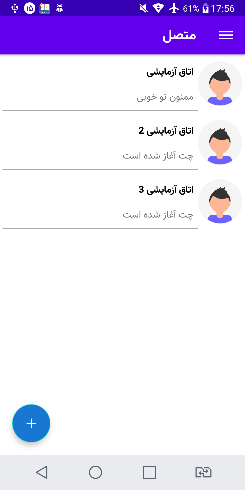

# MessageApp
This is a messaging app for android that was written with Socket IO
this app also has a server in two part includes socket server and main server
socket server was written in node js and main server has benn written in laravel/php

this app is an instant messaging app so when you sent your message in one side other site
will get it immediately.i hope  you enjoy using it ! :)

<table><tr><td>

</td><td>

</td></tr>
</table>
